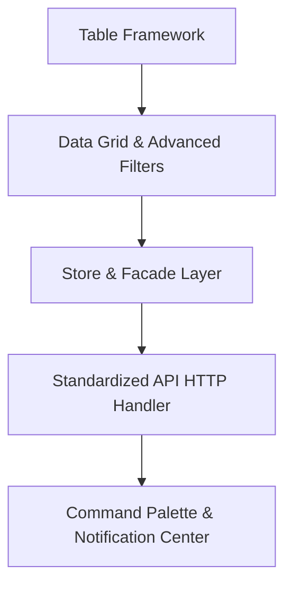

# EMS Architecture Consolidation Review

This document presents a comprehensive architectural review of the core layers and frameworks in the Employee Management System (EMS) following the Wave 1 Form Control Migration.

---

## 1. Current Architecture Score: 92/100

* **Project Structure & Standalone Adoption**: **95/100** (Full standalone layout, clean routes, and direct lazy loading).
* **Signal Integration**: **94/100** (Robust read-only computed signal patterns across state, configuration, and permission maps).
* **CVA Implementation**: **96/100** (Programmatic self-registration without Redundant provider circular dependencies).
* **Accessibility**: **88/100** (Template variable ID mapping is highly compliant, but custom checkbox and icon components need accessibility adjustments).

---

## 2. Strengths

1. **Circular Dependency Remediation**:
   * Programmatic self-registration (`this.ngControl.valueAccessor = this` inside `BaseFormControl`) completely eliminates Angular's classic circular DI issues while letting custom components read status flags from `NgControl` without template clutter.
2. **Programmatic Dialog Service**:
   * `DialogService` leverages Angular's dynamic `createComponent` and `ApplicationRef.attachView` to dynamically append dialog elements to the DOM. This keeps components layout-free and handles cleanup automatically.
3. **Reactive Router Breadcrumbs**:
   * `ShellStateService` hooks into `NavigationEnd` to parse routing data trees, automatically updating page titles, active modules, and breadcrumbs without layout boilerplate.
4. **Environment Independent Configuration**:
   * `RuntimeConfigService` loads the configuration JSON dynamically before bootstrapping using `APP_INITIALIZER`. This enables building a single container image that is run across local, staging, and production environments.

---

## 3. Weaknesses

1. **Direct LocalStorage Coupling**:
   * Direct calls to `localStorage` are scattered in `SettingsComponent` and `ShellStateService` instead of utilizing a unified state persistence abstraction layer.
2. **Generic Icon Accessibility**:
   * The custom `IconComponent` outputs raw text values (`{{ icon() }}`) inside a Material Symbols span. If screen readers read this text, they will announce the icon code literally (e.g. `"settings_backup_restore"`), which violates WCAG readability rules.
3. **Inline Layout Styles**:
   * SCSS directories contain duplicated layout variables and focus borders. Focus outline behaviors are unified globally, but layout margins in custom components occasionally use ad-hoc Tailwind/Bootstrap margins rather than a standardized design token.

---

## 4. Technical Debt

1. **Validation Coverage in Settings**:
   * The session timeout minutes field does not carry validation parameters in the TS model (e.g., minimum and maximum limits), exposing the configuration to potential overflow or negative values.
2. **Missing State Abstraction**:
   * State management is split between component inputs, service signals, and direct LocalStorage. As features scale (e.g., Users, Employees), local component state will become difficult to synchronize.

---

## 5. Refactoring Opportunities

1. **Secure Icon Wrapper**:
   * Add `aria-hidden="true"` to the Material Symbol span inside `icon.component.html`. Expose an optional `[label]` input for screen reader announcements.
2. **Settings Numeric Validations**:
   * Add `Validators.min(1)` and `Validators.max(1440)` to the `timeout` control inside `SettingsComponent`.

---

## 6. Missing Enterprise Components

1. **Table Framework**:
   * Unified grid component managing sorting, paginator queries, inline item templates, and multiple check selection.
2. **Store & Facade Layer**:
   * Centralized state stores wrapping feature actions and selectors.
3. **Advanced Filtering Builder**:
   * A unified visual interface for building search criteria query strings for lists.

---

## 7. Recommended Build Order

