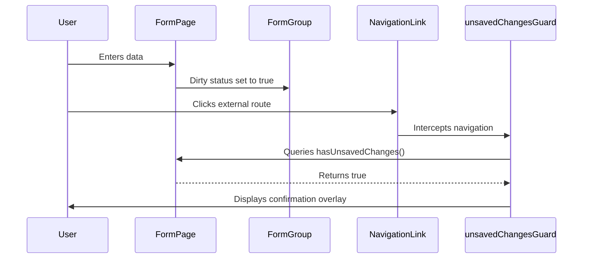

# EMS Form Architecture Plan

This document details the standardization of form components, validation logic, and navigation guards to deliver robust user inputs across the EMS application.

---

## 1. Standardized Form Architecture

All data entry forms in EMS will adopt a structured lifecycle coordination:



---

## 2. Forms Standardization Specification

### 2.1 Validation & Error Feedback
* **Error Indicators**: Visual validation rules will apply consistently across form inputs. Standard bootstrap classes (`is-invalid`) will apply automatically when controls are touched and validation fails.
* **Focus Invalid Control**: On form submission, if invalid fields exist, the client will auto-focus and scroll to the first invalid element:
  ```typescript
  export function focusOnInvalidField(formContainer: HTMLElement): void {
    const invalidControl = formContainer.querySelector('.is-invalid, ng-invalid');
    if (invalidControl) {
      (invalidControl as HTMLElement).focus();
      invalidControl.scrollIntoView({ behavior: 'smooth', block: 'center' });
    }
  }
  ```

### 2.2 Unsaved Changes Guard (`SaveChangesGuard`)
* All forms will register a `CanDeactivate` guard utilizing a common `UnsavedChangesAware` interface:
  ```typescript
  export interface UnsavedChangesAware {
    hasUnsavedChanges: () => boolean;
  }
  ```
* Standardize checking forms by matching current form state values against original fetched values (`pristine` status checking).
* Refactor basic window alerts (`window.confirm`) to instead display standard confirmation dialogs managed via `DialogService`.

### 2.3 Async Validators
* All async checks (e.g., uniqueness validation for employee codes or usernames) will implement debounce limits (300ms) to minimize redundant backend queries:
  ```typescript
  export function employeeCodeValidator(service: EmployeeService): AsyncValidatorFn {
    return (control: AbstractControl) => {
      if (!control.value) return of(null);
      return timer(300).pipe(
        switchMap(() => service.checkCodeExists(control.value)),
        map(exists => exists ? { codeExists: true } : null),
        catchError(() => of(null))
      );
    };
  };
  ```
