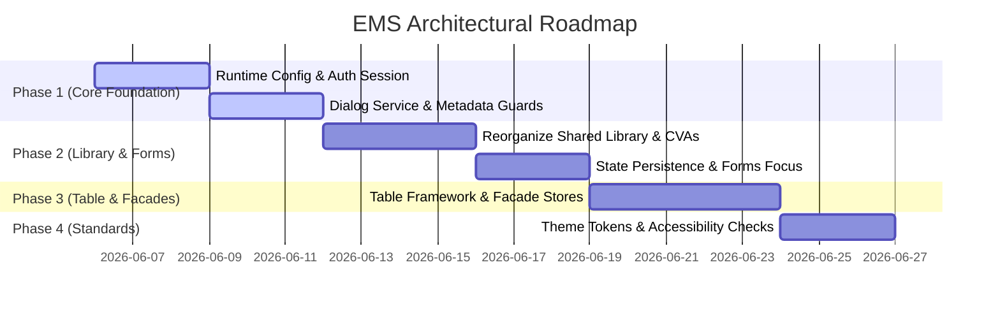

# EMS Master Implementation Plan

This master plan integrates all architectural upgrades for the Employee Management System (EMS). It details the phased implementation roadmap, ranks recommendation priorities, lists affected files, and evaluates migration risk.

---

## 1. Upgrade Priority Matrix

We rank implementation tasks in descending order of priority, from P1 (Core Foundation) to P4 (Optimization & Clinical Workflows).

| Phase | Recommendation Name | Rank | Expected Benefits | Affected Files | Migration Risk |
|---|---|---|---|---|---|
| **Phase 1** | Runtime Configuration (`RuntimeConfigService`) | **P1** | Environment-independent builds. Eliminates recompilations. | `src/app/app.config.ts`, `src/app/core/services/` | Low |
| **Phase 1** | Auth Session Decomposition (`AuthSession` / `Token`) | **P1** | Clean isolation of token storage logic from user actions. | `src/app/core/auth/` | Medium |
| **Phase 1** | Dialog Overlay Service (`DialogService`) | **P1** | Standardizes confirm/delete popups. Eliminates template modals. | `src/app/core/services/`, user/employee components | Medium |
| **Phase 1** | Route Metadata-Driven Permissions (RBAC Guard) | **P1** | Eliminates fragile URL checks. Simplifies security definitions. | `src/app/app.routes.ts`, `src/app/core/guards/` | Medium-High |
| **Phase 2** | Shared Library Standard Reorganization | **P2** | Organizes shared assets in clear folders. Prevents circular imports. | `src/app/shared/` | Low-Medium |
| **Phase 2** | Persistent List State Adapter (`RcPersistService`) | **P2** | Retains search/filter views during routing/navigation. | `src/app/shared/services/`, table components | Medium |
| **Phase 2** | Standardized Form Controls (CVA) | **P2** | Eliminates repetitive custom inputs. Uniform validation. | `src/app/shared/components/` | Medium |
| **Phase 2** | Focus Invalid Control Behavior | **P2** | Seamless form navigation by focusing invalid control inputs. | `src/app/shared/validators/`, form components | Low |
| **Phase 3** | Reusable Table Component Framework | **P3** | Generic list layout templates. Standardizes CRUD views. | `src/app/shared/components/table/` | High |
| **Phase 3** | State Store Facades (`EmployeeFacade`) | **P3** | Decouples components from services. Enhances code testability. | `src/app/features/` | Medium |
| **Phase 4** | Theme Token and Accessibility Standards | **P4** | Screen-reader and keyboard compatibility. Standard color systems. | `src/styles.scss`, HTML files | Low |

---

## 2. Implementation Roadmap



---

## 3. Migration Safety Guidelines

* **Feature Flags**: Introduce structural upgrades progressively. Keep existing services as fallbacks during transition.
* **Component Parity**: Preserve styling and translation keys. The design layout language must not change.
* **Build Validation Verification**: Run validation compilations after completing each sub-task:
  ```bash
  npx tsc --noEmit --project tsconfig.json
  npx ng build
  ```
