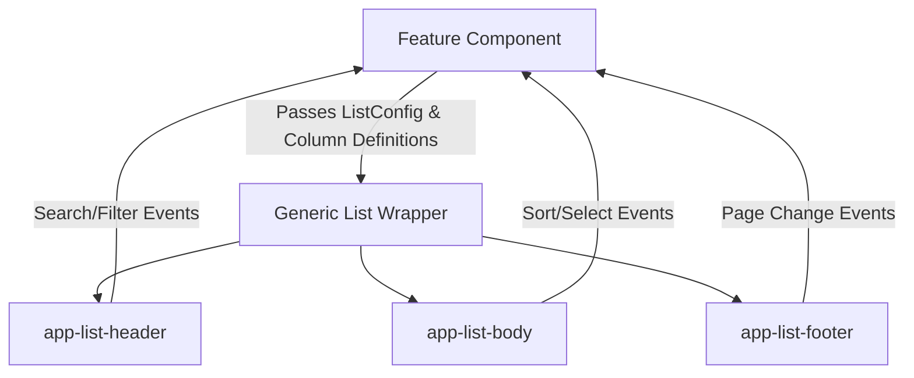

# EMS Table Framework Plan

> [!IMPORTANT]
> **Design Phase Only.** Do not implement this framework yet. Align and finalize the contract signatures below.

This plan details the design for a configuration-driven table and list framework for EMS, standardizing the tabular operations for Employees, Users, Roles, Audit Logs, Notifications, and Reports.

---

## 1. Table Framework Architecture

The framework consists of a configuration wrapper surrounding three key components:
1. **app-list-header**: Handles search inputs, global filters, column settings toggles, bulk actions, and exports.
2. **app-list-body**: Renders columns dynamically, displays loading skeletons, tracks row selection, and raises sorting actions.
3. **app-pagination**: Renders active paging indexes.



---

## 2. Core Framework Contracts

### 2.1 Table Column Schema
```typescript
export interface TableColumn<T> {
  key: keyof T | string;
  label: string;
  sortable: boolean;
  visible?: boolean;
  type?: 'text' | 'date' | 'badge' | 'actions' | 'custom';
  badgeClassMap?: Record<string, string>;
}
```

### 2.2 List Configuration Context
```typescript
export interface ListConfig<T> {
  persistKey: string;          // localStorage state key
  defaultPageSize: number;     // e.g., 10, 25, 50
  defaultSortField: keyof T;
  defaultSortDirection: 'asc' | 'desc';
  columns: TableColumn<T>[];
  actions: {
    allowDelete: boolean;
    allowEdit: boolean;
    allowExport: boolean;
    allowBulk: boolean;
  };
}
```

### 2.3 List State Manager (`ListStateStore`)
A focused class manages state queries and triggers side effects:
```typescript
export interface ListState<T> {
  query: string;
  filters: Record<string, any>;
  sortField: keyof T | string;
  sortDirection: 'asc' | 'desc';
  page: number;
  pageSize: number;
  hiddenColumns: string[];
}
```

---

## 3. Core Feature Requirements

* **Sorting**: Managed via `th` click handlers that raise sort change events, updating the state configuration.
* **Search**: Debounced text search (300ms delay) updating the active query parameter.
* **Pagination**: Interactive pagination control footer.
* **Filter Persistence**: Backed by `RcPersistService` to store active filters in `localStorage`, maintaining view state on page reload.
* **Column Visibility**: An options dropdown checkbox group to toggle visible column arrays dynamically.
* **Export**: Emits current state settings (query, filters, columns) to the `DownloadService` to initiate CSV downloads.
* **Bulk Actions**: Checkbox selection trackers updating checked ID list buffers (`selectedIds`).
* **Empty & Loading States**: Skeleton grid overlays displayed while backend calls remain unresolved.
