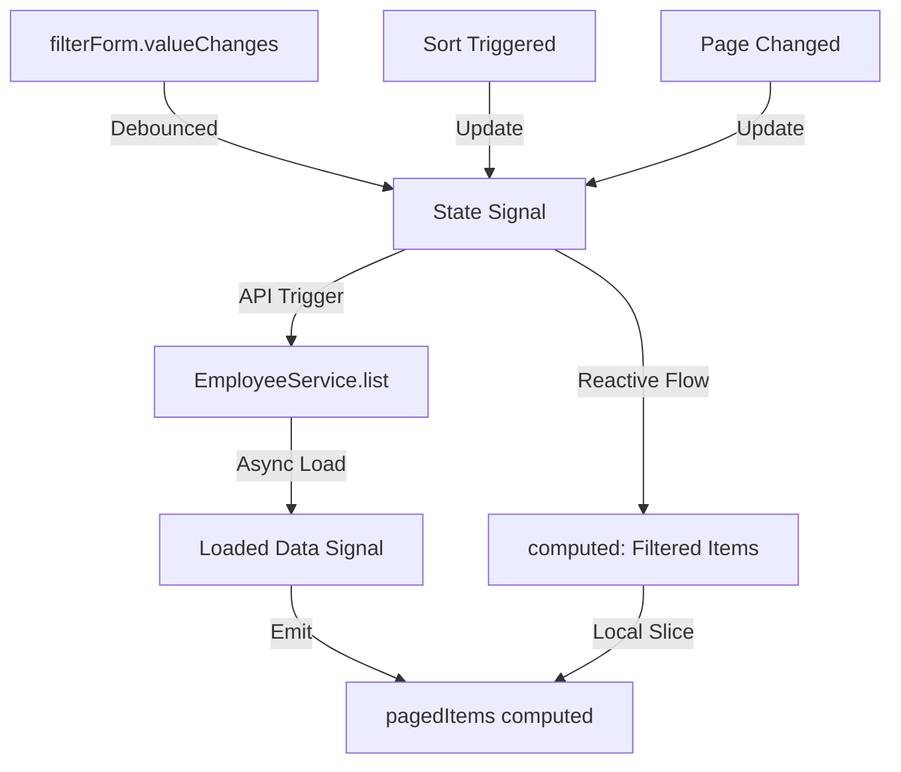

# Table Framework Architecture

This document designs a reusable, type-safe, signal-based Table Framework for the Employee Management System (EMS). It will reside under `src/app/shared/table-framework/`.

---

## 1. Directory Structure

```text
src/app/shared/table-framework/
├── table.component.ts                  # Main table view layout component
├── table.component.html
├── table.component.scss
├── table-toolbar.component.ts          # Table toolbar (search, columns dropdown, filter chips)
├── table-toolbar.component.html
├── table-pagination.component.ts       # Reusable footer pagination control
├── table-pagination.component.html
├── table-loading.component.ts          # Skeleton loader state renderer
├── table-empty-state.component.ts      # Empty state renderer with customizable presets
├── table-column.model.ts               # Column configuration interfaces
├── table-state.model.ts                # Sorting, pagination, and filter state interfaces
├── filters/
│   ├── table-filter.directive.ts       # Utility directive for custom custom filters
│   └── filter-preset.service.ts        # Service managing custom filter presets
├── search/
│   └── table-search.component.ts       # Search field with input debouncing and clear triggers
├── selection/
│   └── table-selection.service.ts      # Service managing multi-row selection states
└── export/
    └── table-export.directive.ts       # Directives to connect table rows to ExportService
```

---

## 2. Models and Contracts

### A. Column Definition (`table-column.model.ts`)
```ts
import { TemplateRef } from '@angular/core';

export interface TableColumn<T> {
  key: keyof T | string;
  label: string;
  sortable?: boolean;
  visible?: boolean;
  type?: 'text' | 'badge' | 'date' | 'phone' | 'custom';
  customTemplate?: TemplateRef<any>;      // Reference for custom content formatting
  cellClass?: string;                     // Inline CSS classes for the td cell
  headerClass?: string;                   // Inline CSS classes for the th cell
  sortField?: string;                     // Custom sorting field mapping
}
```

### B. Table State Definition (`table-state.model.ts`)
```ts
export interface SortEntry {
  field: string;
  direction: 'asc' | 'desc';
}

export interface TableState {
  page: number;
  pageSize: number;
  sortStack: SortEntry[];
  query: string;
  filters: Record<string, any>;
}
```

---

## 3. Component Contracts

### A. `TableComponent<T>`
The core component managing columns rendering, sorting triggers, row templates, and selection states.

```ts
import { Component, input, output, contentChild, TemplateRef, computed } from '@angular/core';
import { TableColumn } from './table-column.model';
import { SortEntry } from './table-state.model';

@Component({
  selector: 'app-table-framework',
  standalone: true,
  templateUrl: './table.component.html',
  styleUrl: './table.component.scss'
})
export class TableComponent<T extends { id: string }> {
  // Inputs
  readonly rows = input.required<T[]>();
  readonly columns = input.required<TableColumn<T>[]>();
  readonly loading = input<boolean>(false);
  readonly selectedIds = input<string[]>([]);
  readonly sortStack = input<SortEntry[]>([]);
  readonly selectable = input<boolean>(false);
  
  // Outputs
  readonly selectionChange = output<string[]>();
  readonly sortChange = output<SortEntry[]>();
  readonly rowClick = output<T>();

  // Custom template definitions
  readonly rowActionsTemplate = contentChild<TemplateRef<any>>('rowActions');

  // Derived columns list
  readonly visibleColumns = computed(() => this.columns().filter(col => col.visible !== false));

  // State calculations
  readonly allSelected = computed(() => {
    const data = this.rows();
    return data.length > 0 && data.every(row => this.selectedIds().includes(row.id));
  });

  readonly someSelected = computed(() => {
    const data = this.rows();
    const selectedCount = data.filter(row => this.selectedIds().includes(row.id)).length;
    return selectedCount > 0 && selectedCount < data.length;
  });

  toggleAll(): void {
    if (this.allSelected()) {
      this.selectionChange.emit([]);
    } else {
      this.selectionChange.emit(this.rows().map(row => row.id));
    }
  }

  toggleRow(row: T): void {
    const current = this.selectedIds();
    const updated = current.includes(row.id)
      ? current.filter(id => id !== row.id)
      : [...current, row.id];
    this.selectionChange.emit(updated);
  }

  triggerSort(columnKey: string): void {
    const current = [...this.sortStack()];
    const index = current.findIndex(e => e.field === columnKey);
    let updated: SortEntry[];
    
    if (index === -1) {
      updated = [...current, { field: columnKey, direction: 'asc' }];
    } else {
      updated = current.map((e, idx) => 
        idx === index 
          ? { ...e, direction: e.direction === 'asc' ? 'desc' : 'asc' } 
          : e
      );
    }
    this.sortChange.emit(updated);
  }
}
```

---

### B. `TableToolbarComponent`
Renders search fields, filter chips, visibility options, and bulk action triggers.

```ts
import { Component, input, output, computed } from '@angular/core';
import { TableColumn } from './table-column.model';

@Component({
  selector: 'app-table-toolbar',
  standalone: true,
  templateUrl: './table-toolbar.component.html'
})
export class TableToolbarComponent {
  // Inputs
  readonly columns = input.required<TableColumn<any>[]>();
  readonly selectedCount = input<number>(0);
  readonly query = input<string>('');
  readonly activeChips = input<{ key: string; label: string }[]>([]);

  // Outputs
  readonly queryChange = output<string>();
  readonly clearQuery = output<void>();
  readonly clearAllFilters = output<void>();
  readonly clearChip = output<string>();
  readonly columnVisibilityChange = output<TableColumn<any>[]>();
  readonly bulkAction = output<string>();
}
```

---

### C. `TablePaginationComponent`
Renders paginated page buttons, records ranges, and page size triggers.

```ts
import { Component, input, output, computed } from '@angular/core';

@Component({
  selector: 'app-table-pagination',
  standalone: true,
  templateUrl: './table-pagination.component.html'
})
export class TablePaginationComponent {
  readonly page = input.required<number>();
  readonly pageSize = input.required<number>();
  readonly total = input.required<number>();
  
  readonly pageChange = output<number>();
  readonly pageSizeChange = output<number>();

  readonly totalPages = computed(() => Math.max(1, Math.ceil(this.total() / this.pageSize())));
  readonly rangeStart = computed(() => Math.min((this.page() - 1) * this.pageSize() + 1, this.total()));
  readonly rangeEnd = computed(() => Math.min(this.page() * this.pageSize(), this.total()));
  readonly pages = computed(() => Array.from({ length: this.totalPages() }, (_, i) => i + 1).slice(0, 7));

  setPage(target: number): void {
    if (target >= 1 && target <= this.totalPages() && target !== this.page()) {
      this.pageChange.emit(target);
    }
  }
}
```

---

## 4. Architectural Integrations

### A. RBAC Integration Strategy
Integrating RBAC with the table framework is achieved by using structural directives (`*appPermission`) and programmatic authorization queries.

1. **Directives Inside Headers / Toolbars:**
   Action elements (such as bulk activate/delete inside `table-toolbar` or custom cell actions inside templates) are conditionally rendered using the standard permission checking directives:
   ```html
   <button *appPermission="{ module: 'employees', action: 'delete' }" 
           class="btn btn-danger" 
           (click)="onDeleteSelected()">
     Delete Selected
   </button>
   ```
2. **Column Configuration Permissions:**
   The columns configuration accepts an optional `permission` payload. The table component filters out unauthorized columns on initialization:
   ```ts
   // In TableComponent:
   readonly authorizedColumns = computed(() => {
     return this.columns().filter(col => {
       if (!col.requiredPermission) return true;
       return this.permissionService.hasPermission(
         col.requiredPermission.module, 
         col.requiredPermission.action
       );
     });
   });
   ```

---

### B. RuntimeConfig Integration Strategy
The framework supports reading default tables configurations dynamically from a global `RuntimeConfig` settings service. This allows defaults like pagination limits (`pageSize`), themes, and exports options to update at runtime.

1. **Global Fallbacks:**
   If a component leaves configuration inputs undefined, the table components fall back on configurations provided by `RuntimeConfigService`:
   ```ts
   private readonly runtimeConfig = inject(RuntimeConfigService);
   readonly defaultPageSize = this.runtimeConfig.get('tables.defaultPageSize', 10);
   readonly availablePageSizes = this.runtimeConfig.get('tables.pageSizes', [5, 10, 25, 50]);
   ```
2. **Preset Layout Settings:**
   Saved table layouts (such as customized columns visibility options) are loaded from settings presets and applied as columns configurations on component load.

---

### C. Signal Architecture
The Table Framework uses writable signals to manage states, and reads derived states using computed signals to avoid unnecessary template updates.



---

## 5. Accessibility, Theming, and Mobile Design

### A. Accessibility (A11y) Requirements
1. **ARIA Roles & Labels:**
   * Table wrappers are labeled with `role="table"`, header cells use `role="columnheader"`, and rows use `role="row"`.
   * Clear visual and structural associations are enforced using descriptive labels (`aria-label="Select row Jane Smith"`).
   * Sorting controls state is announced using `aria-sort="ascending" | "descending" | "none"`.
2. **Keyboard Controls:**
   * Interactive header buttons can be focused using `Tab` and selected with `Enter`/`Space`.
   * Checkbox selections are togglable via keyboard actions.
   * Modals and preset menus support `Escape` to close focus overlays.

### B. Dark Mode Compatibility
1. **Color Systems:**
   * The framework relies on standard theme tokens: `var(--app-bg)`, `var(--app-surface)`, `var(--app-border)`, and `var(--app-text)`.
   * Active row highlights are applied using custom CSS variables (e.g., `background-color: var(--table-row-selected-bg, rgba(15, 108, 189, 0.08))`).
2. **Component Borders:**
   * Borders, hover effects, and selection styles adapt dynamically when the global theme toggles dark mode.

### C. Mobile Responsiveness Strategy
1. **Flexible Table Scrolling:**
   * Standard table layouts are wrapped inside overflow scrolling wrappers (`.table-responsive`).
2. **Card Stack Fallback Layout (Media Queries):**
   * On small viewports (`max-width: 768px`), custom CSS media queries transform tables into stacked list layouts:
     ```css
     @media (max-width: 768px) {
       table, thead, tbody, th, td, tr {
         display: block;
       }
       thead {
         display: none; /* Hide standard th headers */
       }
       tr {
         margin-bottom: 1rem;
         border: 1px solid var(--app-border);
         border-radius: 6px;
       }
       td {
         display: flex;
         justify-content: space-between;
         padding: 0.5rem 1rem;
         border-bottom: 1px dashed var(--app-border);
       }
       td::before {
         content: attr(data-label); /* Show labels inline */
         font-weight: 600;
         color: var(--app-text-secondary);
       }
     }
     ```
